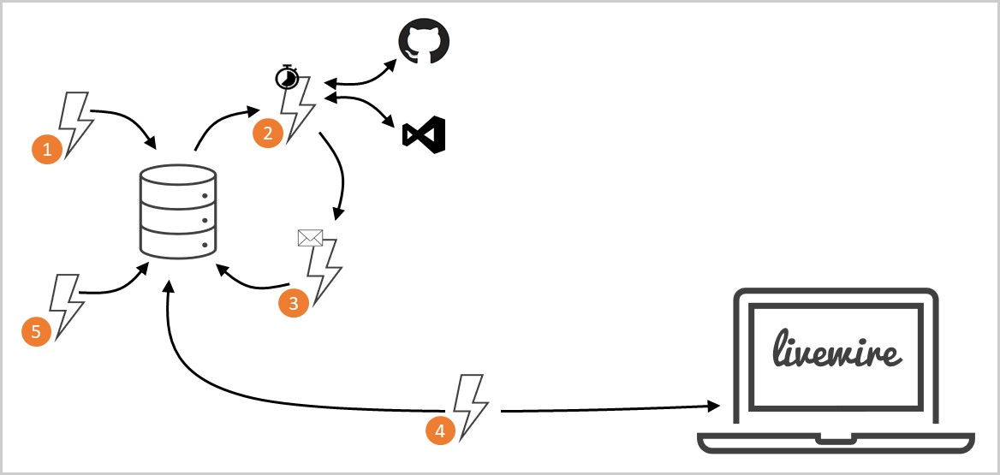
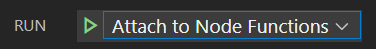

The Livewire architecture is based off a series of [serverless functions](https://azure.com/functions) which create a system that remains perpetually updated without the need for data entry. As resources are added to the system, the Livewire backend contacts GitHub and the VS Code Marketplace and updates the database with relevant changes in the projects. GitHub repositories provide metadata to Livewire via a [livewire.config.json](livewire.config.js) file and from the GitHub REST API, while VS Code extensions get provide information directly from the [marketplace website](https://marketplace.visualstudio.com/vscode).

The following items correspond the the numbers in the above diagram and are the lifeblood of Livewire:

1. Resources (as GitHub repositories or VS Code extensions) are [added to the database](api/addResource) by providing a URL to the resource.
2. [Based on a schedule](api/detectChanges), the system checks GitHub and the VS Code Marketplace for any changes to items. Changes are saved to a message queue for processing.
3. As messages are added to the queue, the [database is updated](api/updateResource) with the latest changes from the web.
4. The Livewire UI is then provided with a [shaped and aggregated view of the raw data](api/getResources) for the display and filtering on the client.
5. If immediate updates are required for a resource, an [endpoint](api/ping) is available for on-demand updates to the database.

## Setup

- Clone the repository
- Make a copy of *local.settings.example.json* and name the file *local.settings.json* and add the appropriate connection string and key values.
- In the *api* folder, run `npm i` to install dependencies
  - Set **VUE_APP_API_BASE_URL** environment variable to your function app locally.  Typically `http://localhost:7071/api/`.
- In the *ui* folder, run `npm i` to install dependencies

## Running the app

- Open the *api* and *ui* projects in different instances of Visual Studio Code.
- Start the *api* functions app by starting a debugging session
    
- Once the *api* project is launched, start the *ui* project by running `npm run serve`
- Run the app in your browser at http://localhost:8080
